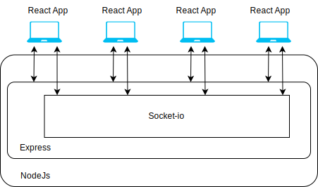
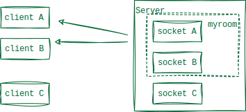
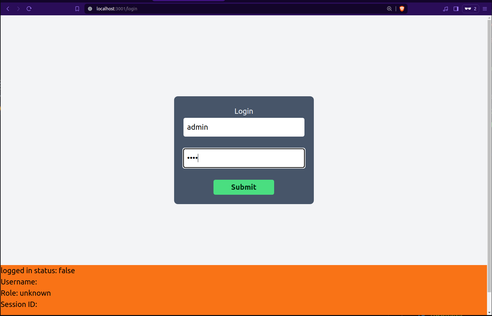
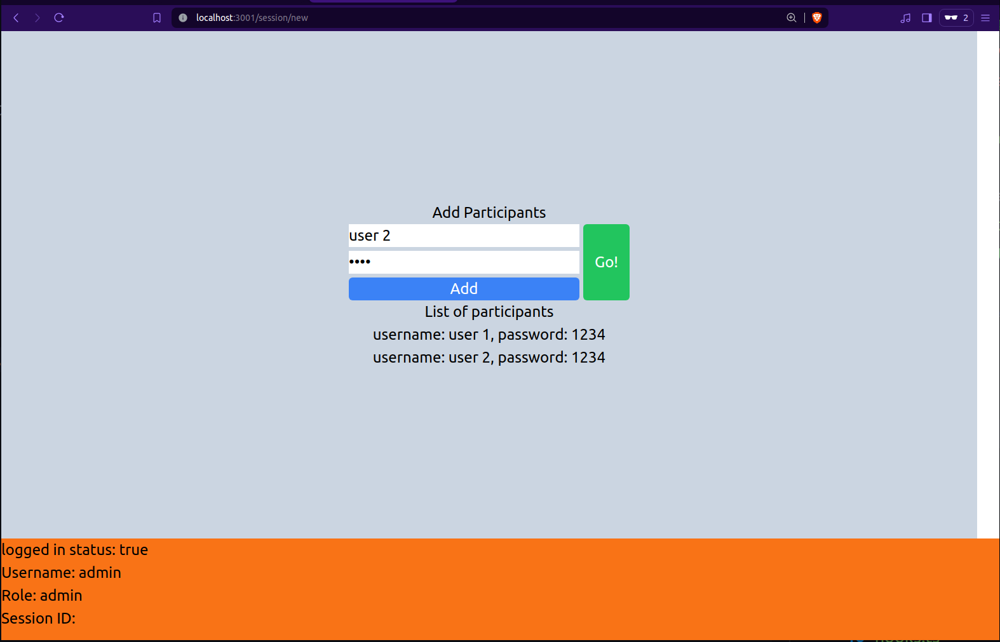
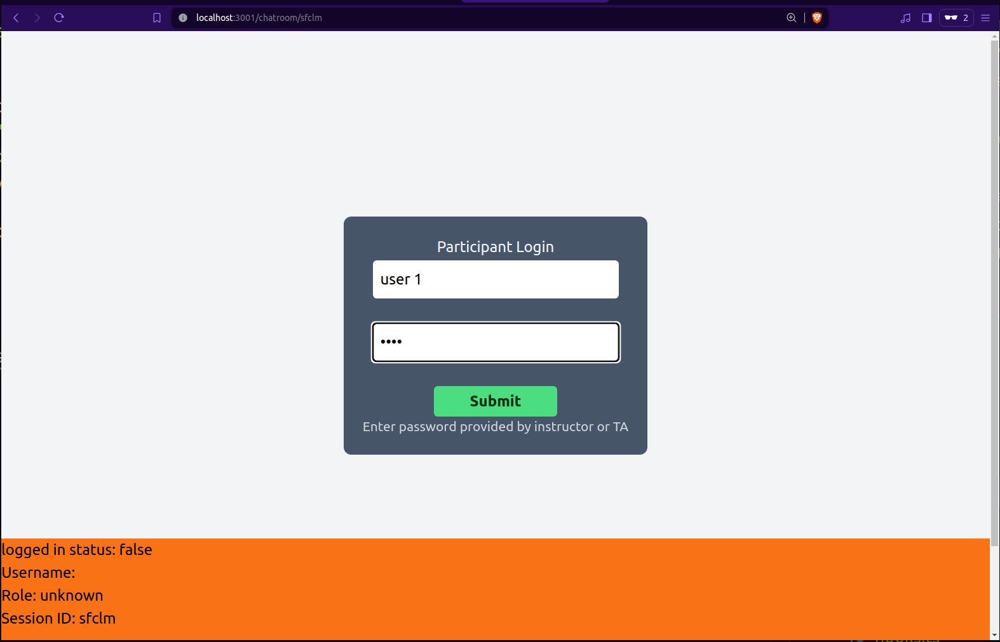
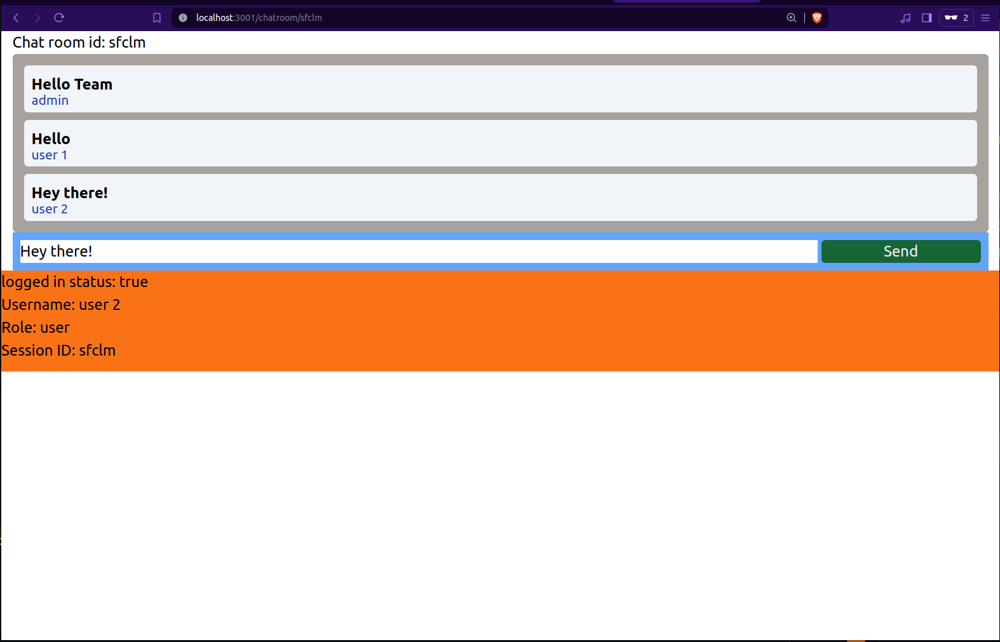
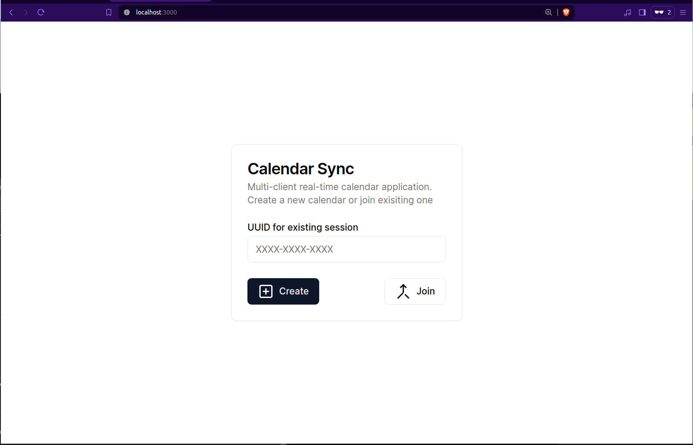
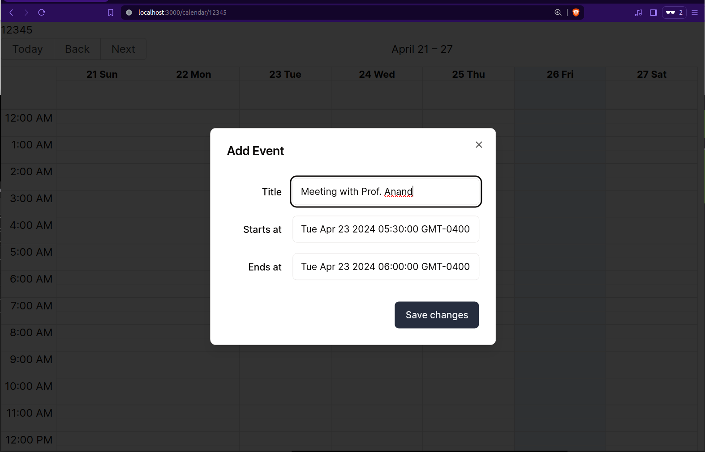
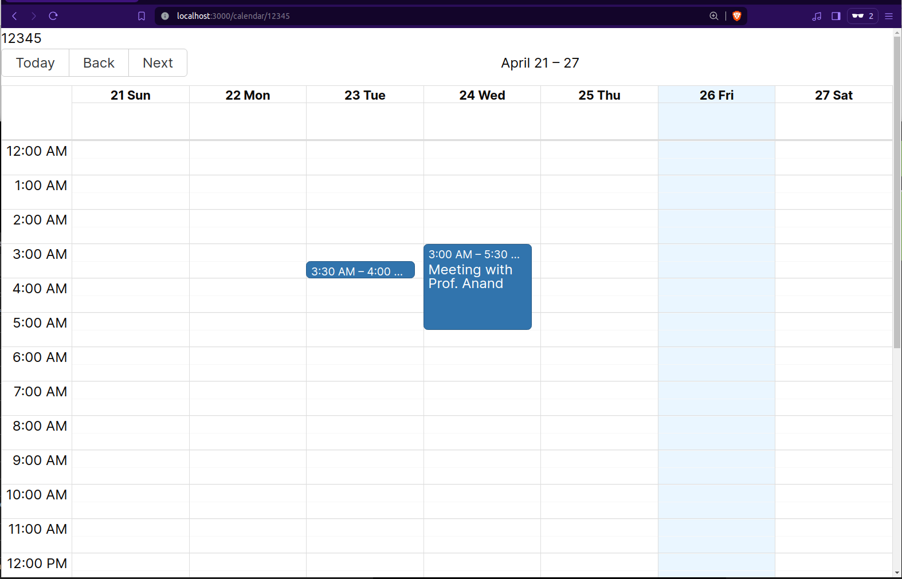

# Contents
1. Introduction
2. Line of code
3. How much synchonization calls - Server & UI
4. Comparison with Elm code on various parts and functionalities
5. Screenshots
    - Discuss UI component's look and feel
6. Scalability - To Do
7. Package/ Bundle Size

# Introduction

This report attempts to compare two different approaches to develop multi-client real-time synchronized web applications. To distinguishes between two approaches the report also cover technicality of the approaches in enough depth. The focus is to report the developer experience while building two identical application with two approaches. Report also covers the functionality of the applications, implementation and the challenges associated with each approach, this includes User Interface comparison, line of code, underlying libraries and frameworks that were used to create application. Lastly, report compares the size of the applications.


# Two Approaches

Most modern web applications utilizes some sort of frameworks to tame the complexity and other benefits that comes with it. Any complex modern web application consists of essentially 3 parts - Frontend, Backend, Database. These interconnected parts work together to deliver functionality to the users. Frontend of a web application is the the part users interact with directly via a client like web browsers. Backend handles the logic and processes that happen on the server side. It manages request from the frontend, processes data, interacts with databases, and performs computation or business logic. Databases is where the web applications stores and retrieves data. It is responsible for managing structured data that the application needs to persist.

A numerous frameworks are available today to build such web applications. Each framework provides similar set of functionalities and comes with advantages and disadvantages. They differ in various aspects and one of such important aspect is Developer Experience or DevX[1]. Developer Experience can play crucial role in adoption of a technology. Several key elements that directly contribute to the DevX includes documentation, tooling, support and community. Bad DevX can hinder the adoption of a technology or a new framework despite its advantages and hence it becomes an important consideration while choosing a technology or stack.

Several frameworks available today to create web applications pays enormous amount of attention to DevX while delivering features and functionality. Few industry grade frameworks include[2]:
1. Frontend frameworks: Angular, React and VueJs
2. Backend frameworks: Node.js, Express, ASP.NET core
3. Databases: PostgreSQL, MySQL, SQLite, MongoDB


## First Approach: TEASync
TEASync is a framework developed to create multi-player applications using a single programming language. Using Elm, developer can write backend logic and frontend logic for a multi-client application. Application states can be defined using SDDraw tool and can be incorporated to make DevX better. A backend server with ability to sync message across multiple client needs to be spawned at STabl.Rocks. 

## Second Approach: React, NodeJs, Express, and other libraries
React is a frontend development framework fairly popular choice for building complex web applications. NodeJs serves as backend environment running backend end services making it possible to sync data and messages across the different clients. Other libraries are used to reduce the boiler plate code and fill the functionalities a certain framework lacks.

## Applications
### First Application: Chatroom
Chatroom allows a mentor to setup a chatroom and credentials required to join chatroom. Once a chatroom is created the users can join the session using the credentials setup by mentor. Messages in the chatroom are synced for all connected clients

### Second Application: Sync-Calendar
Sync-calendar app allows users to add and modify events on a calendar. The events will we visible to all the users and their attributes such as start time and end time further can be modified. 

# Line of Code

One of the criteria for comparing the DevX of two approaches is how many lines of code is required to build a application is with similar set of functionalities. 

Figures and Numbers
        TEASync     Modern Frameworks
App 1   
App 2   264         190(UI side) + 150 (Server side) 

Unlike TEASync, the application logic is split in two major layers i.e. back end and front end. Applications in TEASync are written using Elm whereas Javascript and Typescript are used for modern frameworks. Additionally, modern framework make use of libraries such as `socket-io` and `shadcn` that reduces boilerplate code. 

Comparing the functionalities and features of both frameworks, they both support defining UI components as functions and having a state for components. This state can be used to persist the data between updates in entire application state.

Second comparison can be drawn developer productivity. VSCode IDE used to develop application using modern framework in addition to few extensions to enhance the productivity. TEASync applications can be developed using an online IDE available at STaBL.Rock. TEASync development may require some extra efforts involving looking language documentations as well as framework documentation and lacks integration for extensions. Though there is an option to use VSCode to develop TEASync application to enhance developer experience, it still lacks lacks extension support for the framework itself. 

Setting up development environment for modern frameworks require little efforts of installing NodeJs and additional dependencies using `npm` CLI i.e., Express, Socket-io and React. For TEASync, this process can be skipped as it's been taken care of by the developer of the framework.

Community and long term support is a critical criteria while making architectural decision to choose a technology over another. Modern frameworks have a huge community support for tutorials and any issues encountered during the development phase as compared to TEASync.

We further explain the architecture and implementation of the two apps.

## Architecture
<!-- div {
    display: flex;
    flex-direction: column;
} -->
<div align="center">
    <div  style="display: flex;
        flex-direction: column;
        max-width: 80%;"
        >
        
    <!--  -->
        <tag>Figure 1:Application Architecture</tag>
    </div>
</div>

Clients uses React application to communicate with backend Express and SocketIO server to sync the data among them. The sessions are maintained at server level and clients for a session joins a `room`. 
Local updates propagate update requests to the server and server verifies the requests and finds the `room` associated to the request.
After validation, server emits new state for the application to all clients in `room` for a session.

This flow of information achieves syncing of state to multiple clients.

Few code snippets and patterns from both the apps will be discussed further.

### UI Request for Authentication and Session Creation

For chatroom application, the authorized users can create a chatroom for a defined set of users. 

Authentication calls are made from login page of the application to the backend server to authenticate a user.


```
try {
    const response = await fetch('http://localhost:3002/login/admin', {
        method: 'POST',
        headers: {
            'Content-Type': 'application/json'
        },
        body: JSON.stringify(ob_json)
    });

    if (!response.ok) {
        throw new Error('Network response was not ok');
    }

    dispatch(setUserInfo({username:  username, userType: "admin", isLoggedIn: true}));    
    router.push('/session/new');
```
<div align=center><i>Code Snippet: Authentication Handling</i></div>

Try-catch block handles the API request-response to authentication services by username and password. This logic remains same for both the applications.

For Chatroom application, if an user is successfully authenticated, user is then redirected to a new session page to enter the details of the other users to join the chatroom.

Similarly, for Calendar-sync app user is redirected to the main calendar app and this session can be shared among different users to view and update the calendar.

#### Synchronization

Both of the applications uses `socket-io` to communicate with the backend systems. The apps when loaded, tries to establish the connection with backend socket server using the following code.

```
if (socket) {
    socket.emit('joinRoom', params.id);
    socket.on('updateEvents', (newEvents) => {
        setEvents(newEvents.map((event) => ({
            ...event,
            start: new Date(event.start),
            end: new Date(event.end)
        })));
    });
    socket.on('allEvents', (allEvents: MyEvent[]) => {
        setEvents(allEvents.map((event) => ({
            ...event,
            start: new Date(event.start),
            end: new Date(event.end)
        })));
    })
}
```
<div align=center><i>Code Snippet: Socket Connection and Initialization</i></div>

Above code snippet is from Calendar-sync application shows when a socket is connected successfully, what events it will react to and how data from the events will be processed. On receiving 'updateEvents' event, a new set of Calendar events are received and local state containing the list of events is modified accordingly. Event 'allEvents' is received once a new user joins the session and local events are updated with existing events for the session.

```
function sendMessage(formData) {
        const json_ob = {
            sender: username,
            roomId: sessionId,
            message: formData.get("message")
        }
        if(socket)
            socket.emit('sendMessage', json_ob);
    }

useEffect(() => {
    if (socket) {
        if (userType == 'user') {
            socket.emit('joinRoom', { sessionId, username });
        }
        else if (userType == 'admin') {
            socket.emit('createRoom', { sessionId, username })
        }
        socket.on('joinedRoom', (data) => {
            setChatHistory((previousState) => {
                return data.chatHistory
            });
        });
        socket.on('newMessage', (data) => {
            setChatHistory((previousChatHistory) => {
                return [...previousChatHistory, data];
            })
        });
        socket.on('userJoined', (data) => {
            ...
        });
        socket.on('userLeft', (data) => {
            ...
        });
    }
```
<div align=center><i>Code Snippet: Chatroom application sync calls for sending and receiving data</i></div>

Above code snippet shows the various other events emitted by the frontend for the Chatroom application. If current users is an admin, frontend application sends a request to backend server to start a new session. If current logged in user is a normal participants, socket request is connected to the created room. 

Method `sendMessage` handles the click event on 'send' button and sends the messages entered by the users in the chat box to the server. This includes updating the local history of messages and sending this updated list of messages to the server. Other connected client receives these updates from server when `newMessage` event occurs and local state is updated. Additionally, the frontend application also receives notification for other event such as when a new user joins or a user left using `userJoined` and `userLeft` event respectively.

#### Drag-n-Drop Calendar

Building drag-n-drop components in web applications can be challenging especially when aiming to deliver a seamless and intuitive user experience. Few of these challenges include cross-browser compatibility, event handling and coordination, drop target detection and validation etc. Building an application from scratch where user can seamlessly drag and drop event across the calendar comes with such challenges hence an external library was used. Library `react-big-calendar` along with addon `dragAndDrop` is used to handle challenges. These library comes customization options such as localization, default view- week, month, day, look and feel customization etc. With a few modifications, we were able to utilize this library to suit our needs. 


```
import { Calendar, momentLocalizer, Event, Views } from 'react-big-calendar';
import withDragAndDrop from 'react-big-calendar/lib/addons/dragAndDrop';
import moment from 'moment';
import { useSocket } from '@/app/SocketProvider';

const localizer = momentLocalizer(moment)
const DnDCalendar = withDragAndDrop(Calendar);

interface MyEvent extends Event {
    title: string;
    resourceId: string;
}
export default function Page({ params }: { params: { id: string } }) {
...
    return (
        ...
            <DnDCalendar
                    localizer={localizer}
                    events={events}
                    selectable='true'
                    onSelectSlot={onSelectSlot}
                    defaultView='week'
                    views={['week']}
                    draggableAccessor={(event) => true}
                    startAccessor="start"
                    endAccessor="end"
                    onView={onView}
                    onNavigate={onNavigate}
                    resizable={true}
                    onEventResize={resizeEvent}
                    onEventDrop={resizeEvent}
                />
        ...
    );
}
```
<div align=center><i>Code Snippet: Drag-n-drop Calendar library</i></div>

Above code snippet from Calendar-sync application shows usage of external library. After importing required features from library, we initialize the localizer and assign function to various hooks such as `defaultView`, `onEventResize`, `onEventDrop` etc. DnDCalendar receives list of `events` as input which it render on the calendar. `resizeEvent` function handles user inputs and reacts to actions such as resizing or dragging of an event to different time or day of the week.


### Backend: Express and Socket Server
Backend of the both applications built using Express and Socket-io running in a NodeJs environment. It consist of endpoints to handle the authentication, new session request and socket server to sync data across the connected clients.

Web socket, a communication protocol that supports full-duplex communication channels over a single, long-lived connection between client and serve, is used to emit events whenever a local state is updated at client end. These changes are propagated to the clients as programmed.

```
const express = require('express');
const http = require('http');
const socketIo = require('socket.io');
const cors = require('cors');
const bodyParser = require('body-parser');


const app = express();
app.use(cors());
const server = http.createServer(app);
const port = 5050
const io = socketIo(server, {
    cors: {
        origin: "*", 
        methods: ["GET", "POST"]
    }
});
...
server.listen(port, () => {
    console.log(`Server is running on port ${port}`);
});
```
<div align=center><i>Code Snippet: Backend server initialization</i></div>

Above code snippet show how the backend server is initialized. An Express application acts as http web server with a socket server attached. The ports and other configuration such as accepted HTTP methods and CORS, port can be configured as per the requirements.

Following the initialization, we defined our business logic for authentication and session management. 

```
app.post("/login/admin", (request, response) => {
    const { username, password } = request.body;
    const user = users.find(user => user.username === username && user.password === password);
    if (user) {
        response.json({ message: 'Login successful' });
    } else {
        response.status(401).json({ error: 'Invalid username or password' });
    }
})

app.post("/login/participant", (request, response) => {
    const { username, password, sessionId } = request.body;
    const r_session = sessionParticipants.find((session) => session.id == sessionId)

    if(!r_session){
        response.status(401).json({ error: 'Invalid session' });
    }

    const user = r_session?.participants.find(user => user.username === username && user.password === password);
    if (user) {
        response.json({ message: 'Login successful' });
    } else {
        response.status(401).json({ error: 'Invalid username or password' });
    }
})
```
<div align=center><i>Code Snippet: Backend server authentication</i></div>

Above code snippet show two API endpoints to handle authentication. First API endpoint is to authenticate the user with admin access whereas second API endpoint is used by other participants with no special roles. 

```
io.on('connection', (socket) => {
    let roomId;
     socket.on('createRoom', (payload) => {
        activeRooms[payload.sessionId] = { users: [payload.username], messages: [] };
        socket.join(payload.sessionId);
        socket.emit('roomCreated', payload);
    });

    socket.on('joinRoom', (payload) => {
        const room = activeRooms[payload];
        if(!room){
            activeRooms[payload] = {events:[]};
            console.log(`New room created: ${payload}`);
            activeRooms[payload].userCount = 1;
        }
        if (room) {
            socket.join(payload);
            const events = activeRooms[payload].events;
            socket.emit('allEvents', events);
            activeRooms[payload].userCount++;
        }
    });

    socket.on('updateEvents', (payload) => {
        const { sessionId, newEvents} = payload;
        const room = activeRooms[sessionId];
        if (room) {
            room.events= newEvents;
            io.to(sessionId).emit('updateEvents', newEvents);
        }
    });

    socket.on('disconnect', () => {
        console.log(`Disconnecting...`);
    });
});
```
<div align=center><i>Code Snippet: Backend server synchronization</i></div>

Above code snippet shows the synchronization logic for socket connect. Once a session is started by the authenticated user, the server receives a `createRoom` event. Each session is associated with a unique room ID and further requests for the session will be identified using this room ID. Another import use of this unique room Id is to create `rooms` in socket-io. A room is  an arbitrary channel that sockets can join and leave. It can be used o broadcast events to a subset of clients[].

<div align="center">
    <div  style="display: flex;
        flex-direction: column;
        max-width: 80%;"
        >
        
    <!--  -->
        <tag>Figure 2: SocketIO Rooms</tag>
        <br>
    </div>
</div>

This mechanism let us group the client together and publish events avoiding complex implementation of own.

# User Interface

We used a UI component library[], `shadcn`, to add customization button and dialog boxes in our application. In addition to component library, CSS framework 'Tailwind' to help customize the look and feel of the application[]. These additions helped to create a responsive UI for mobile and desktop clients avoiding boilerplate code to very extent. 

Comparing with TEASync, modifying the look and feel of the components is done while describing the component or loading components from other modules. As currently TEASync does not support any CSS framework or component library, significant effort is required to create professional looking components with animations and other features. 

### Chatroom Application
Chatroom application consists of mainly 4 views. Application's homepage is a login view for the admin users to start a session.

<div align="center">
    <div  style="display: flex;
        flex-direction: column;
        max-width: 80%;"
        >
        
    <!--  -->
        <tag>Figure 3: Chatroom Admin Login</tag>
        <br>
    </div>
</div>


After login, admins will be redirected to the new page to create a session. On this screen, admin can enter the users details who can join the session.

<div align="center">
    <div  style="display: flex;
        flex-direction: column;
        max-width: 80%;"
        >
        
    <!--  -->
        <tag>Figure 6: Chatroom New Session</tag>
        <br>
    </div>
</div>


After creating the session by clicking 'Go!' button, admin will be redirected to the chatroom and other users can login using the generated URL.

Other participants can join the session by entering the credentials provided by the admin and will be redirected to the chatroom.

Lastly, all uses upon login will be able to see the chat history and send new messages.

<div align="center">
    <div  style="display: flex;
        flex-direction: column;
        max-width: 80%;"
        >
        
    <!--  -->
        <tag>Figure 4: Chatroom Admin Login</tag>
        <br>
    </div>
</div>


<div align="center">
    <div  style="display: flex;
        flex-direction: column;
        max-width: 80%;"
        >
        
    <!--  -->
        <tag>Figure 7: Chatroom</tag>
        <br>
    </div>
</div>


### Calendar-sync

Homepage screen let users to create or join any existing session.
<div align="center">
    <div  style="display: flex;
        flex-direction: column;
        max-width: 80%;"
        >
        
    <!--  -->
        <tag>Figure 5: Calendar-sync Login</tag>
        <br>
    </div>
</div>

Choosing any of the options, user will be redirected to the calendar view page and they will see existing events if any. 

In order to create a new event, users can double click on a slot on the calendar and they will be presented a dialog box to enter the event details.

<div align="center">
    <div  style="display: flex;
        flex-direction: column;
        max-width: 80%;"
        >
        
    <!--  -->
        <tag>Figure 8: Calendar-sync create new event</tag>
        <br>
    </div>
</div>

After saving changes, the event will be added to the calendar and it will be reflected to all connected clients.

<div align="center">
    <div  style="display: flex;
        flex-direction: column;
        max-width: 80%;"
        >
        
    <!--  -->
        <tag>Figure 9: Calendar-sync View</tag>
        <br>
    </div>
</div>

# References
[1] https://swimm.io/learn/developer-experience/what-is-developer-experience-devx-pillars-and-best-practices

[2] https://survey.stackoverflow.co/2023/